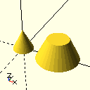

Each file can be run, it will write to the output.scad file.
Click on an image to get a larger image.

[example_apply1.py](example_apply1.py)

[example_box1.py](example_box1.py)

[example_box2.py](example_box2.py)

[example_circle1.py](example_circle1.py)

[example_circle2.py](example_circle2.py)

[example_cone1.py](example_cone1.py)

[example_cylinder1.py](example_cylinder1.py)

[example_facets1.py](example_facets1.py)

[example_facets2.py](example_facets2.py)

[example_hull1.py](example_hull1.py)

[example_minkowski1.py](example_minkowski1.py)

[example_mirror1.py](example_mirror1.py)

[example_modifier1.py](example_modifier1.py)

[example_polygon1.py](example_polygon1.py)

[example_rectangle1.py](example_rectangle1.py)

[example_rectangle2.py](example_rectangle2.py)

[example_repeat2.py](example_repeat2.py)

[example_repeat4.py](example_repeat4.py)

[example_repeat8.py](example_repeat8.py)

[example_resize1.py](example_resize1.py)

[example_resize2.py](example_resize2.py)

[example_rotate1.py](example_rotate1.py)

[example_scale1.py](example_scale1.py)

[example_sphere1.py](example_sphere1.py)

[example_text1.py](example_text1.py)

[example_text2.py](example_text2.py)

[intro_asi.py](intro_asi.py)

[intro_bccs.py](intro_bccs.py)

[intro_extrude.py](intro_extrude.py)

[intro_negatives1.py](intro_negatives1.py)

[intro_rcpt.py](intro_rcpt.py)

[intro_repeat1.py](intro_repeat1.py)

[intro_vrmsr.py](intro_vrmsr.py)

[readme_snowman.py](readme_snowman.py)

[readme_triangle.py](readme_triangle.py)

