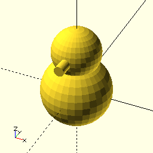
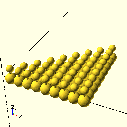

# PSML : Python Solid Modeling Library

version: 0.01 - 2020-02-21

This is a Python library (Python 3 required) for writing
3D models that can be rendered and processed by 
[OpenSCAD](https://www.openscad.org).

OpenSCAD is a great tool for rendering a 3D model and generating
an stl file from it for 3D printing.
The OpenSCAD built-in language is effective for simple projects
and I like its functional-programming feeling,
but I missed the general-purpose features of a true programming language,
so why not use Python to create OpenSCAD files?
Apparently I was not the first with this idea, but I found the
existing libraries unsatisfactory, at least to me.
I guess that says more about me than about those libraries.
So as all stubborn programmers do, I created yet another one.

~~~Python
from psml import *
( sphere( 15 ) + 
  shift( 0, 0, 18 ) ** (
      sphere( 10 ) +
      rotate( 90, 0, 0 ) ** cylinder( 2, 15 ))).write()
~~~

Sphere and cylinder are 3D solids. 
Shift is a 3D operator that shifts its subject in the specified
(z, y and z) direction. 
Rotate rotates its subject by the specified angles (in degrees) 
around the x, y and z axises.
The \*\* (power operator) applies a shift or rotate to a solid.
The + operator combines solids.
Finally the write method writes the corresponding OpenSCAD code
to the output.scad file.
When this file is opened in OpenSCAD it renders a simple snowman.

The power of a general purpose language, in this case Python's
List comprehension and reduce, can be used to create seemingly complex
solids with just a few lines.
 
~~~Python
from psml import *
from functools import reduce
model = reduce( 
   lambda a, b: a + b, (
      ( 25 * shift( x, y )) ** (
         sphere( 15 ) + 
         shift( 0, 0, 30 ) ** sphere( 10 ) + 
         cylinder( 3, 30 )
      ) for x in range( 1, 10 ) for y in range( 0, x )))
model.write( "output.scad" )
~~~

To use psml, arrange for the psml/psml.py file 
to be importable from your project. 
In the examples I add its directory to the search path.

~~~Python
import sys
sys.path.append( "../psml" )
~~~

Workflow is
- edit the Python source 
- run it from a command line
- have OpenSCAD with the result file open, 
enable Design => Automatic Reload and Preview.
   
This library is very much work-in-progress. 
Feedback is welcome. 
Constructive feedback even more.

Similar libraries:
   - [SolidPython](https://github.com/SolidCode/SolidPython)
   - [OpenPySCAD](https://pypi.org/project/OpenPySCAD)
   
-----------------------------------------------------------------------------   
   
ToDo list
- simplify and check the shift parameters
- more examples
- user manual
- auto-generate images and readme.md from the examples?
- generate the Python reference

-----------------------------------------------------------------------------      
      
(c) Wouter van Ooijen (wouter.vanooijen@hu.nl) 2020

Distributed under the Boost Software License, Version 1.0.
(See accompanying file license_1_0.txt or copy at 
http://www.boost.org/LICENSE_1_0.txt) 